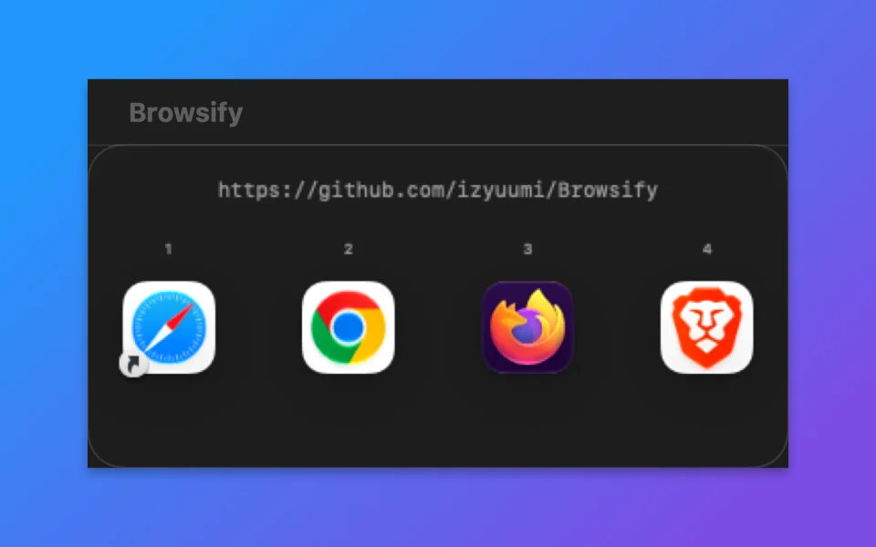

# Browsify

**Make every link open in the right browser profile or Mac app.**

Browsify is a native macOS menu bar app for people who keep work, personal, and client identities separate. Links clicked in Slack, Mail, Calendar, Terminal, and other apps can open where you are already signed in.

[Website](https://browsify.yumi.to/) · [Mac App Store](https://apps.apple.com/app/browsify/id6754360715?mt=12) · [Support](https://browsify.yumi.to/support/) · [Privacy](https://browsify.yumi.to/privacy/)

## What it does

- Routes URLs by domain or URL pattern
- Opens links in a specific Chrome, Firefox, Brave, Edge, Vivaldi, or Chromium profile
- Supports Arc, Safari, Orion, Opera, DuckDuckGo, and other installed browsers as destinations
- Sends supported links directly to Mac apps such as Zoom, Teams, and Slack
- Shows a keyboard-friendly picker when no rule matches
- Optionally removes common tracking parameters before opening a link
- Runs as a lightweight native menu bar app

## Important limitation

Browsify handles links that macOS sends to its default HTTP/HTTPS handler, including links from apps such as Slack, Mail, Calendar, and Terminal. Links clicked inside an already-open browser normally stay under that browser's control and do not pass through Browsify.

## Privacy

Browsify has no analytics or network requests. URL processing and preferences stay on your Mac. See the full [privacy policy](PRIVACY.md).

## Build from source

1. Open `Browsify.xcodeproj` in Xcode 26 or later.
2. Select the Browsify scheme.
3. Build and run on macOS 14 or later.

The source is public for inspection. No open-source license is currently granted; all rights are reserved unless a file states otherwise.

## Support

Found a bug or have a routing use case Browsify does not cover? [Open a GitHub issue](https://github.com/izyuumi/Browsify/issues) or use the [support page](https://browsify.yumi.to/support/).
